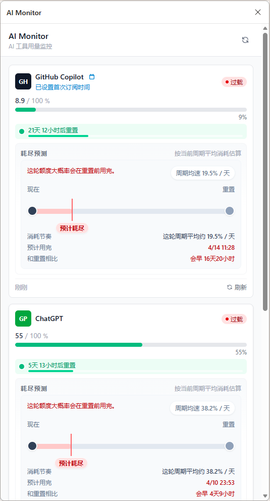
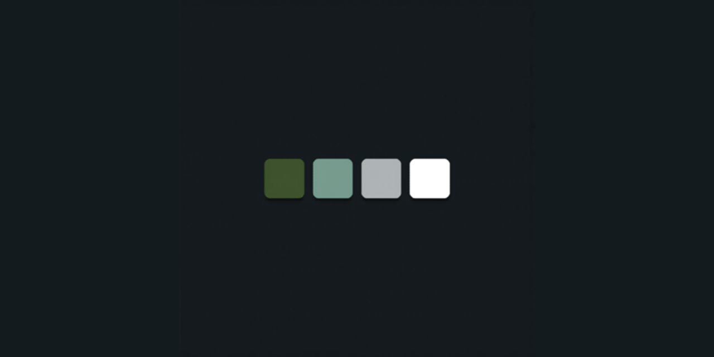

# AI Monitor

<p align="center">
  
  
</p>

AI Monitor 是一个面向 Edge 浏览器开发的 AI 配额监控工具。当前仓库同时包含：

- 浏览器扩展：抓取 GitHub Copilot、ChatGPT / Codex、Kimi 的额度页面并汇总展示
- Windows 托盘程序：通过 `http://127.0.0.1:38431` 接收扩展推送，在系统托盘中显示三个平台的剩余百分比

目前这个项目只在 Edge 浏览器上完成了开发、测试和日常使用，暂未对其他 Chromium 浏览器做兼容性验证。

当前已支持：

- GitHub Copilot
- ChatGPT / Codex
- Kimi

扩展会基于你当前浏览器里已经登录的平台页面，抓取可见的套餐额度信息，并统一展示在侧边栏中，帮助你快速判断：

- 哪个平台当前额度最充足
- 哪个平台按当前速度最容易提前耗尽
- 现在优先使用哪个模型更合适

如果你本来就在同时订阅多个 AI 包月服务，这个工具的目的就是把这些零散的额度页面收拢起来，变成一个更清楚的配额看板，同时在 Windows 托盘中提供轻量化的剩余额度总览。

## 这个工具是干什么的

这个工具不是通用的 AI 聊天入口，也不是模型聚合调用器。

它的核心用途是：**检测 AI 包月套餐配额是否快要用完，并辅助判断当前优先该使用哪个平台。**

更具体地说，它关注的是：

- 套餐额度已经用了多少
- 距离下一次重置还有多久
- 按当前消耗速度，这个周期内会不会提前见底

## 功能特性

- 聚合查看多个 AI 包月平台的额度与使用情况
- 后台定时刷新并缓存结果
- 支持在插件侧边栏中自定义自动刷新间隔
- 侧边栏采用极简看板布局，默认优先展示进度条、剩余额度与风险提示
- Popup 采用快览模式，每个平台只保留最关键的进度信息
- 展示每个平台的重置倒计时
- 基于已用额度和重置周期计算当前负荷
- 当预测会在重置前耗尽时，显示轻量竖条预警与预计耗尽时间
- 按“当前更适合优先使用”到“当前负荷更重”的顺序自动排序平台
- 将最新状态同步到本地 Windows 托盘 EXE
- 在托盘 tooltip 和右键菜单中展示三个平台的剩余额度

## 当前界面

- Side Panel：作为完整主面板，默认只保留平台列表、关键额度进度、轻量风险提示，以及底部自动刷新设置
- Popup：作为快速查看入口，仅显示平台名称、状态和进度条，不承载复杂预测或设置
- 平台图标：统一为单色 glyph 风格，减少品牌色干扰
- 预测信息：仅在有足够样本时展示，并在高风险情况下给出更明显的竖条预警

## 工作原理

AI Monitor 不依赖私有 API，也不需要你提供 API Key。

它的工作流程是：

1. 在需要时后台打开对应平台的官方用量页面
2. 通过 content script 从页面 DOM 中提取可见的额度信息
3. 将结果写入 `chrome.storage.local`
4. 在 popup 和 side panel 中统一渲染
5. 后台把平台快照推送到本地 `localhost` 托盘服务
6. 托盘程序更新动态图标、tooltip 和右键菜单

当前使用的重置周期：

- GitHub Copilot：30 天
- ChatGPT / Codex：7 天
- Kimi：7 天

## 技术栈

- React 19
- TypeScript
- Vite 8
- CRXJS
- Tailwind CSS 4
- Manifest V3
- Rust
- Axum
- tray-icon

## 环境要求

- Node.js 20 LTS 或更高
- npm
- Rust toolchain

当前依赖链中的 Vite 已不再兼容 Node 14。若本机仍停留在 Node 14，`npm run build` 会失败。

自动刷新默认间隔为 30 分钟，且在扩展后台恢复时如果发现已经超过设定间隔，会立即补做一次整体刷新，避免出现“已经过了刷新点但还没刷”的情况。

扩展在后台刷新时会跟踪自己打开的临时标签页；如果因为超时、异常或 service worker 挂起导致没有正常关闭，这些遗留标签页会在下次启动或下次刷新前自动清理。

## 本地开发

安装依赖：

```bash
npm install
```

类型检查：

```bash
npm run compile
```

构建扩展：

```bash
npm run build
```

构建发布产物（`.zip`）：

```bash
npm run build:release
```

产物会输出到 `release/` 目录。

构建 Windows 托盘程序：

```bash
npm run tray:build
```

发布版构建：

```bash
npm run tray:build:release
```

一键构建扩展 + 托盘：

```bash
npm run build:all
```

运行托盘程序：

```bash
npm run tray:run
```

首次启动后，托盘程序会在本地监听：

```text
http://127.0.0.1:38431
```

扩展每次刷新平台状态、平台启用/禁用变化、以及后台启动初始化时，都会自动把最新快照推送给托盘。

托盘程序支持开机自启。当前实现会先生成一个本地启动脚本，再由注册表 `Run` 项指向该脚本，以确保登录后能在正确工作目录中稳定启动。

在侧边栏底部可以直接修改自动刷新时间。点击“确认”后会立即：

1. 更新后台自动刷新周期
2. 立刻执行一次整体刷新
3. 将最新状态同步到托盘

## 在 Edge 中加载

1. 运行 `npm run build`
2. 打开 `edge://extensions`
3. 开启“开发人员模式”
4. 点击“加载解压缩的扩展”
5. 选择生成出来的 `dist/` 目录

## 托盘联调流程

1. 确保本机使用 Node 20 LTS
2. 在 VS Code 终端运行 `npm install`
3. 运行 `npm run tray:run`
4. 另开一个终端运行 `npm run build`
5. 在 Edge 中加载 `dist/` 目录
6. 打开至少一个已登录的平台页面，等待扩展刷新
7. 观察 Windows 托盘图标、tooltip 和右键菜单是否更新

如果托盘未启动，扩展仍会照常工作，只是本地推送会被忽略并在控制台记录警告。

## GitHub Actions 自动发布

仓库已包含 `.github/workflows/release-crx.yml`：

- 当 `main` 或 `master` 有新 push 时，自动执行构建
- 自动生成 `release/*.zip`
- 自动更新一个固定 tag 为 `latest` 的 GitHub Release

由于 Chrome/Edge 对非商店 `.crx` 安装有限制，当前 release 仅发布 `zip`。本地安装时，请解压后在扩展管理页加载解压目录，或直接使用仓库本地构建出来的 `dist/`。

## VS Code 工作流

仓库已提供以下任务：

- `Build Extension`
- `Build Tray (Debug)`
- `Build Tray (Release)`
- `Build All`
- `Run Tray`

推荐联调顺序：

1. 先执行 `Run Tray`
2. 再执行 `Build Extension`
3. 在 Edge 重新加载扩展
4. 打开平台页面触发抓取

## 权限说明

扩展会申请以下权限：

- `storage`：缓存平台数据和设置
- `alarms`：后台定时刷新
- `tabs`：在需要时后台打开平台页面抓取数据
- `scripting`：扩展运行时支持
- `sidePanel`：渲染主侧边栏 UI
- `cookies`、`activeTab`：平台登录态和页面访问支持

Host 权限仅限于当前支持的平台域名，以及本地托盘桥接使用的 `127.0.0.1 / localhost` 回环地址。

## 限制说明

- 目前仅在 Edge 浏览器中测试和使用
- 数据提取依赖各平台当前页面 DOM 结构
- 如果平台前端结构变化，选择器需要同步调整
- 后台刷新时，浏览器标签栏可能会短暂出现未激活的新标签页
- Windows 托盘程序只显示扩展最后一次同步的数据，不会自行抓取网页

## 规划方向

- 支持更多 AI 平台
- 更明确的额度耗尽预警
- 在 UI 中自定义刷新频率
- 增加历史趋势与报表能力

## License

MIT，详见 [LICENSE](LICENSE)。

---

## English

AI Monitor is an Edge-first quota monitor for AI subscriptions.

This repository now contains both:

- a browser extension that reads quota data from official usage pages
- a Windows tray app that receives quota snapshots over `http://127.0.0.1:38431`

The extension still handles page scraping and storage. The tray app only displays the latest synced state from the extension.

### Development

```bash
npm install
npm run compile
npm run build
npm run build:release
npm run tray:build
```

### Load Into Edge

1. Run `npm run build`
2. Open `edge://extensions`
3. Enable Developer mode
4. Click `Load unpacked`
5. Select the generated `dist/` folder

### License

MIT. See [LICENSE](LICENSE).
