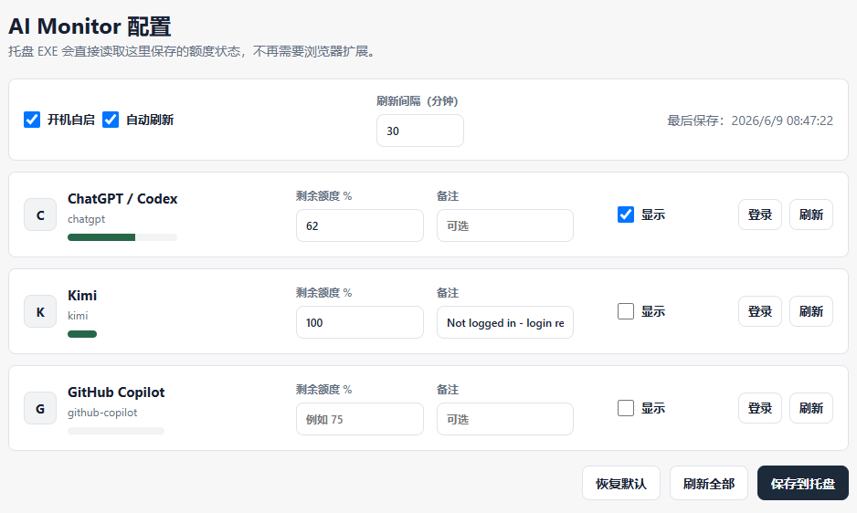
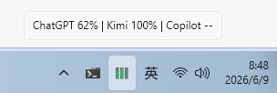

# AI Monitor

AI Monitor 是一个 Windows 系统托盘应用，用来集中查看 ChatGPT / Codex、Kimi 和 GitHub Copilot 的订阅额度状态。应用在本机启动一个配置面板，使用系统 WebView2 完成登录和额度页面抓取，并把结果同步到托盘图标、托盘提示和右键菜单中。

## 示例

配置面板：



托盘提示：



## 主要功能

- 在系统托盘展示已勾选平台的剩余额度
- 托盘 tooltip 使用简短汇总，例如 `ChatGPT 62% | Kimi 100% | Copilot --`
- 托盘右键菜单显示平台状态、最近同步时间、配置入口、开机自启开关和退出入口
- 配置面板支持登录、单平台刷新、全部刷新、手动编辑额度和备注
- 支持自动刷新，可配置 5 到 720 分钟的刷新间隔
- 支持开机自启
- 登录态和配置都保存在本机用户目录
- 本地配置服务仅监听 `127.0.0.1:38431`

## 支持平台

| 平台 | 平台 ID | 抓取入口 |
| --- | --- | --- |
| ChatGPT / Codex | `chatgpt` | `https://chatgpt.com/codex/cloud/settings/usage` |
| Kimi | `kimi` | `https://www.kimi.com/code/console` |
| GitHub Copilot | `github-copilot` | `https://github.com/settings/copilot` |

## 运行环境

- Windows
- Rust stable toolchain
- Node.js / npm，用于执行仓库中的构建脚本
- Microsoft Edge WebView2 Runtime

## 使用方式

启动应用后，在系统托盘找到 `AI Monitor Tray`，右键打开 `打开配置面板`。配置面板地址为：

```text
http://127.0.0.1:38431
```

推荐流程：

1. 勾选需要在托盘中展示的平台。
2. 点击平台行中的 `登录`，在弹出的 WebView2 窗口完成账号登录。
3. 回到配置面板，点击单个平台的 `刷新`，或点击底部 `刷新全部`。
4. 根据需要调整 `自动刷新` 和刷新间隔。
5. 点击 `保存到托盘`，托盘图标、tooltip 和右键菜单会使用最新状态。

`显示` 只控制托盘展示。平台没有勾选时不会出现在托盘汇总中，但本地登录态和已保存数据会继续保留。

## 构建和开发

安装依赖后可通过 npm 脚本运行：

```bash
npm run tray:run
```

构建调试版：

```bash
npm run build
```

构建发布版：

```bash
npm run build:release
```

也可以直接调用 Cargo：

```bash
cargo run --manifest-path desktop-tray/Cargo.toml
cargo build --release --manifest-path desktop-tray/Cargo.toml
```

发布版产物路径：

```text
desktop-tray/target/release/ai-monitor-tray.exe
```

## 本地数据

AI Monitor 使用 `%LOCALAPPDATA%\AI Monitor\tray` 保存运行时数据：

| 路径 | 说明 |
| --- | --- |
| `%LOCALAPPDATA%\AI Monitor\tray\tray-state.json` | 平台配置、额度、备注、自动刷新设置 |
| `%LOCALAPPDATA%\AI Monitor\tray\webview-profile` | WebView2 登录态 |
| `%LOCALAPPDATA%\AI Monitor\tray\launch-at-login.cmd` | 开机自启启动脚本 |

开机自启通过当前用户的注册表 Run 项启用，名称为 `AI Monitor Tray`。

## 本地接口

托盘应用启动后提供以下本地接口：

| 方法 | 路径 | 说明 |
| --- | --- | --- |
| `GET` | `/` | 配置面板 |
| `GET` | `/api/health` | 健康检查 |
| `GET` | `/api/state` | 读取当前配置 |
| `POST` | `/api/state` | 保存配置并刷新托盘状态 |
| `GET` | `/api/startup` | 读取开机自启状态 |
| `POST` | `/api/startup` | 修改开机自启状态 |
| `POST` | `/api/login` | 打开指定平台登录窗口 |
| `POST` | `/api/refresh` | 刷新指定平台或全部已显示平台 |

## 项目结构

```text
.
├── desktop-tray/
│   ├── Cargo.toml
│   └── src/
│       ├── app.rs        # 托盘图标、菜单、事件处理
│       ├── autostart.rs  # Windows 开机自启
│       ├── browser.rs    # WebView2 登录窗口和额度抓取
│       ├── icon.rs       # 托盘图标绘制
│       ├── main.rs       # 应用入口
│       ├── model.rs      # 配置、平台和运行时模型
│       └── server.rs     # 配置面板和本地 API
├── docs/images/          # README 示例图片
├── package.json          # npm 构建脚本
└── README.md
```

## 发布

GitHub Actions 会在 Windows runner 上构建 `desktop-tray/target/release/ai-monitor-tray.exe`，并更新 `latest` release。

## License

MIT，详见 [LICENSE](LICENSE)。
